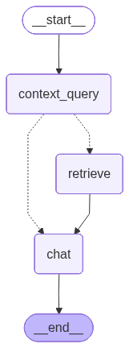

# Astrology Coversational Agent

A Vedic astrology conversation agent powered by LangGraph and RAG (Retrieval-Augmented Generation). This intelligent agent provides personalized astrological guidance by combining user birth chart analysis with a comprehensive knowledge base of Vedic astrology principles.

## Overview

MyNakshpoc is an AI-powered astrology conversation agent that:
- Generates complete kundali (birth charts) from user birth details
- Provides personalized astrological guidance based on user's chart
- Uses RAG to retrieve relevant astrological knowledge from a curated knowledge base
- Maintains conversation context across sessions using LangGraph's checkpoint system
- Supports both English and Hindi languages

## Agent Architecture

The agent uses a LangGraph-based workflow with intelligent RAG integration. The flow is designed to minimize unnecessary retrievals while ensuring accurate, context-aware responses.



### Agent Flow

1. **`context_query` Node**: 
   - Analyzes the user's query along with their kundali details
   - Determines if RAG retrieval is needed (checks previous context to avoid redundant retrievals)
   - Generates optimized search queries and metadata filters (zodiac signs, planetary factors, life areas, nakshatras)
   - Routes to either `retrieve` or directly to `chat` based on context availability

2. **`retrieve` Node** (Conditional):
   - Fetches relevant astrological knowledge from ChromaDB vector database
   - Uses semantic search with metadata filtering based on user's chart
   - Only executed when additional context is required

3. **`chat` Node**:
   - Generates the final response using LLM
   - Incorporates retrieved context and user's kundali details
   - Maintains conversation history through LangGraph's checkpoint system

The agent intelligently skips retrieval when:
- The question can be answered with general astrological knowledge
- Required information is already available in previous conversation context
- The query doesn't require specific astrological data retrieval

## API Routers

### 1. Chat Router (`/v1/chat`)

**Endpoint**: `POST /v1/chat`

Handles conversational interactions with the astrology agent.

**Features**:
- Session-based conversation management using LangGraph checkpoints
- Automatic kundali fetching for new sessions
- Context-aware responses using RAG when needed
- Conversation history persistence across requests

**Request Body**:
```json
{
  "session_id": "unique-session-id",
  "message": "What does my sun sign say about my personality?",
  "user_profile": {
    "name": "John Doe",
    "birth_date": "1990-01-15",
    "birth_time": "10:30",
    "birth_place": "New York, USA",
    "preffered_language": "en"
  }
}
```

**Response**:
```json
{
  "response": "Based on your Capricorn sun sign...",
  "context_used": ["zodiac_traits", "planetary_impact"],
  "sun_sign": "Capricorn",
  "moon_sign": "Leo",
  "ascendant_sign": "Scorpio",
  "dasha_info": "Jupiter (2020-01-15 to 2036-01-15) - Current Bhukti: Saturn"
}
```

### 2. Kundali Router (`/v1/kundali`)

**Endpoint**: `POST /v1/kundali`

Generates complete kundali/horoscope details from user birth information.

**Features**:
- Complete astrological chart calculation
- Planetary positions (all 9 planets)
- House positions (12 houses)
- Nakshatra details (star, pada, lords)
- Planetary aspects and conjunctions
- Vimshottari Dasa periods (Maha Dasa and Bhukti)
- Key positions (Sun sign, Moon sign, Ascendant, Lagna Lord)

**Request Body**:
```json
{
  "name": "John Doe",
  "birth_date": "1990-01-15",
  "birth_time": "10:30",
  "birth_place": "New York, USA",
  "preffered_language": "en"
}
```

**Response**: Complete `KundaliDetails` object with all astrological calculations.

## Tech Stack

- **FastAPI** - Modern, fast web framework for building APIs
- **LangGraph** - Framework for building stateful, multi-actor applications with LLMs
- **LangChain** - Framework for developing applications powered by language models
- **OpenAI** - LLM and embeddings (GPT-4o-mini, text-embedding-3-small)
- **ChromaDB** - Vector database for semantic search and RAG
- **Pydantic v2** - Data validation using Python type annotations
- **VedicAstro** - Vedic astrology calculations library
- **Geopy** - Geocoding for birth place location resolution
- **Uvicorn** - ASGI server for FastAPI

## Setup

### Prerequisites

- Python >= 3.13
- UV package manager (recommended) or pip

### Installation

1. **Install dependencies**:
```bash
uv sync
```

2. **Create `.env` file** in the root directory:
```env
OPENAI_API_KEY=your_openai_api_key_here

# LLM Model Configuration (optional - defaults provided)
LLM_CHAT_MODEL=gpt-4o-mini
LLM_STRUCTURED_MODEL=gpt-4o-mini
LLM_CHAT_TEMPERATURE=0.7
LLM_STRUCTURED_TEMPERATURE=0
LLM_EMBEDDING_MODEL=text-embedding-3-small
```

3. **Initialize vector database**:
```bash
cd helper
uv run python data_ingestion.py
```

This will:
- Process JSON files (nakshtras, planetary_impact, zodiac_traits)
- Process text files (career_guidance, love_guidance, spiritual_guidance)
- Create embeddings and store in ChromaDB
- Add rich metadata for filtering (zodiacs, planetary_factors, life_areas)

4. **Run the application**:
```bash
uv run uvicorn main:app --reload
```

The API will be available at `http://localhost:8000`

## Project Structure

```
MyNakshpoc/
├── app/
│   ├── builder.py          # LangGraph graph builder
│   ├── nodes.py            # Graph nodes (context_query, retrieve, chat)
│   ├── state.py            # Graph state definition
│   ├── models.py           # Pydantic models (UserProfile, ChatRequest, etc.)
│   ├── llmclient.py        # LLM client initialization
│   ├── utils.py            # Utility functions (kundali fetching, etc.)
│   └── router/
│       ├── chat_router.py  # Chat endpoint router
│       └── kundali_router.py # Kundali generation router
├── helper/
│   ├── data_ingestion.py   # Data ingestion script
│   ├── init_chroma_db.py   # ChromaDB initialization
│   └── utils/
│       ├── embeddings.py   # Embedding utilities
│       ├── file_processors.py # File processing utilities
│       └── metadata.py     # Metadata extraction
├── data/                   # Source data files
│   ├── nakshtras.json
│   ├── planetary_impact.json
│   ├── zodiac_traits.json
│   ├── carrer_guidance.txt
│   ├── love_guidance.txt
│   └── spiritual_guidance.txt
├── vector_db/              # ChromaDB persistent storage
├── main.py                 # FastAPI application entry point
└── README.md
```

## Features

- **Intelligent RAG**: Context-aware retrieval that minimizes unnecessary database queries
- **Session Management**: Automatic conversation history persistence using LangGraph checkpoints
- **Personalized Guidance**: Responses tailored to user's specific birth chart
- **Multi-language Support**: English and Hindi language support
- **Rich Metadata Filtering**: Filters by zodiac signs, planetary factors, life areas, and nakshatras
- **Complete Kundali Generation**: Full astrological chart with all calculations
- **Dasa Period Tracking**: Current Vimshottari Dasa and Bhukti periods

## API Documentation

Once the server is running, visit:
- **Swagger UI**: `http://localhost:8000/docs`
- **ReDoc**: `http://localhost:8000/redoc`
- **Health Check**: `http://localhost:8000/health`

## Development

Run tests:
```bash
uv run pytest
```

